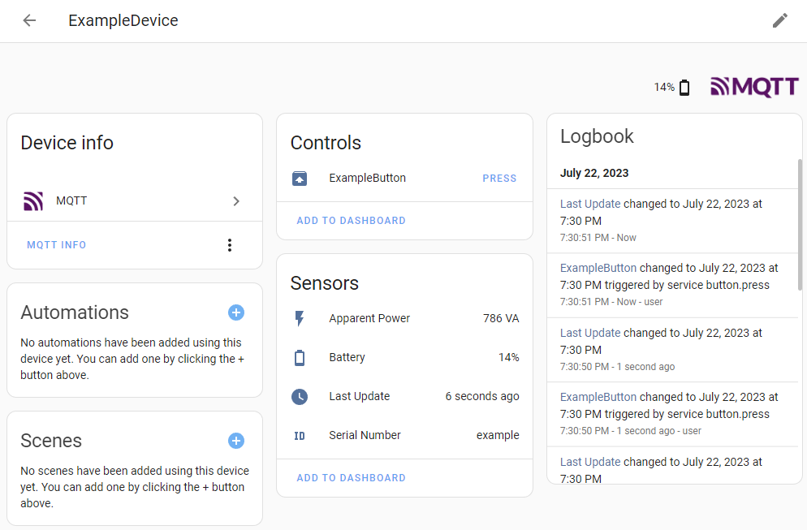
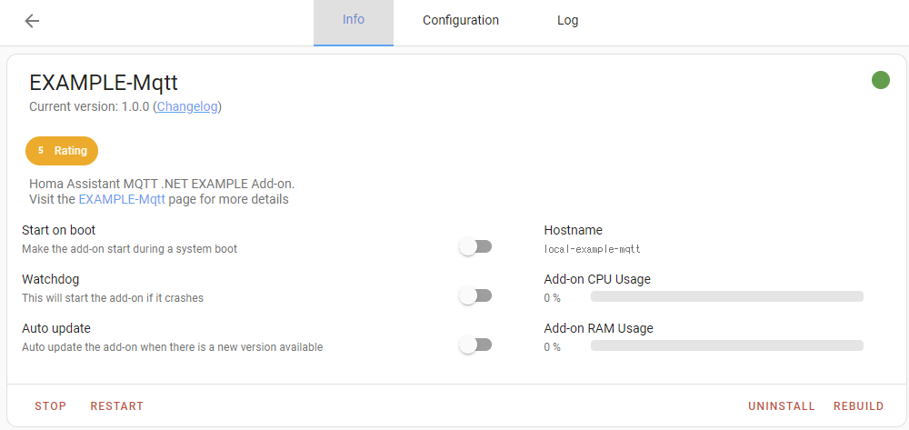
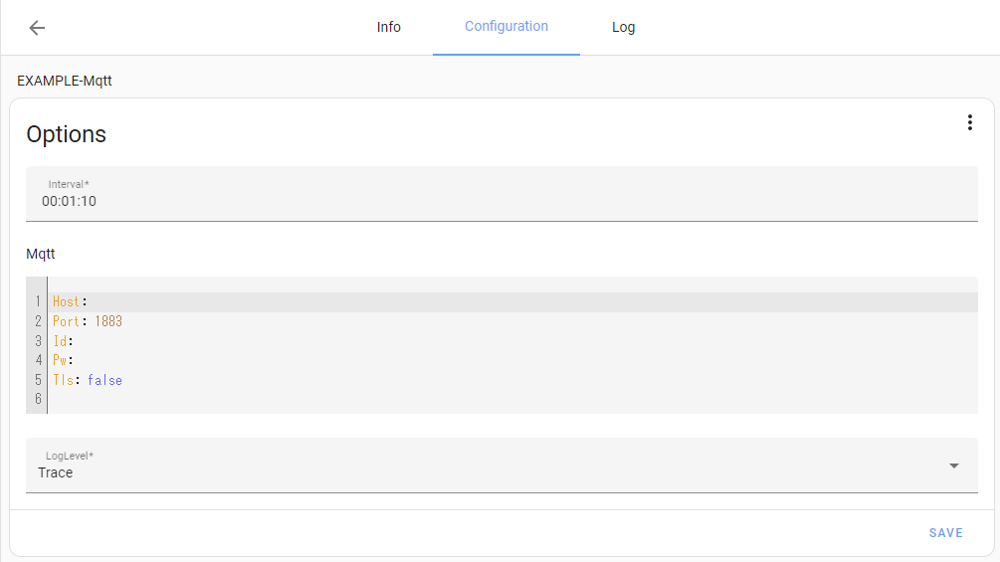
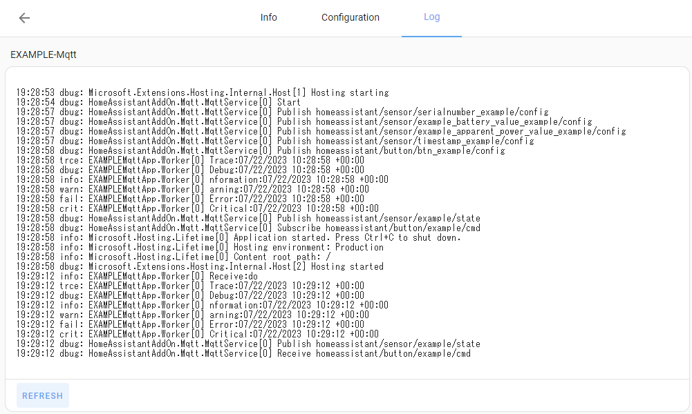

# Home Assistant Add-on .NET App Mqtt Project Template

Project template for developing a Home Assistant add-on in C# .<br>
Application to deliver device and sensor to MQTT integration

## How to install add-on

There are three different methods

1. Use Docker images registered in GitHub Container Registory
    1. Copy `/_from_ghcr.io` (config.yaml only) to HA-OS (`/addons/example-mqtt`)
1. .NET apps pre-compiled and then build a Docker image on HA-OS
    1. Run `./_compile_self/dotnet_publish.ps1`.
    1. Copy `/_compile_self` to HA-OS (`/addons/example-mqtt`)
1. .NET apps at the same time as building Docker images on HA-OS
    1. Copy `src` and `/_build_on_haos` to HA-OS (`/addons/example-mqtt`)
    1. If the HA-OS machine is not powerful, the build (& installation) will take a very long time.<br>(At RasPi3B+, it takes more than 30 minutes.)**Not recommended.**

## Build Docker image and register for GitHub Container Registory

```powershell
./_compile_self/dotnet_publish.ps1

docker build `
  "./_compile_self" `
  -t ghcr.io/EXAMPLE_GIT_HUB_USER/examplemqtt-aarch64:1.0.1 `
  --build-arg BUILD_FROM="homeassistant/aarch64-base:latest" `
  --build-arg BUILD_ARCH="aarch64" `
  --progress=plain `
  --label org.opencontainers.image.source=https://github.com/EXAMPLE_GIT_HUB_USER/examplemqtt-mqtt

docker build `
  "./_compile_self" `
  -t ghcr.io/EXAMPLE_GIT_HUB_USER/examplemqtt-amd64:1.0.1 `
  --build-arg BUILD_FROM="homeassistant/amd64-base:latest" `
  --build-arg BUILD_ARCH="amd64" `
  --progress=plain `
  --label org.opencontainers.image.source=https://github.com/EXAMPLE_GIT_HUB_USER/examplemqtt-mqtt

echo EXAMPLE_GIT_HUB_PERSONAL_ACCESS_TOKEN | docker login ghcr.io -u EXAMPLE_GIT_HUB_USER --password-stdin
docker push ghcr.io/EXAMPLE_GIT_HUB_USER/examplemqtt-aarch64:1.0.1
docker push ghcr.io/EXAMPLE_GIT_HUB_USER/examplemqtt-amd64:1.0.1
```

## Options

|Key|Default|Description|
|--|--|--|
|Interval|`00:01:10`|TimeSpan(`HH:mm:ss`)|
|Mqtt:UseAutoConfig|true|Add-on users using the default Home Assistant Mosquitto integration can set this value to True, as connection details can be detected via the Home Assistant Supervisor API.|
|Mqtt:Host|-||
|Mqtt:Port|-||
|Mqtt:Id|-||
|Mqtt:Pw|-||
|Mqtt:Tls|-||
|LogLevel|`Trace`|`Trace`,`Debug`,`Information`,`Warning`,`Error`,`Critical`,`None`|

## Information for developers (& run outside of add-ons)

* This add-on simply brings the .NET runtime into the Home Assistant base image and launches the .NET console application.
* The application itself can be run on Windows.
    * The sln file can be opened in VisualStudio and debugged.
    * On Windows, you probably do not have access to the add-on configuration file(`/data/options.json`), so configure them in `appsettings.Development.json` instead.
    * Can also be configured from environment variables and command line arguments.<br>See. [.NET Generic Host Default builder settings](https://learn.microsoft.com/en-us/dotnet/core/extensions/generic-host#default-builder-settings)

## Home Assistant Images



